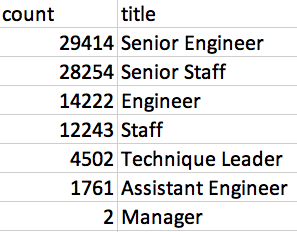

# Pewlett-Hackard-Analysis

## Overview of the analysis
The purpose of this analysis is to determine the number of retiring employees per title and identify employees who are eligible to participate in a mentorship program. This analysis will help prepare for the "silver tsunami" as many current employees reach retirement age.

## Results
- The retirement_titles.csv holds all titles of current employees who were born between 1952-1955, housing multiple titles for some employees due to promotions. There are a total of 133,776 rows of data during this timeframe. 
- The unique_titles.csv takes data from the retirement_titles table using the DISTINCT ON statement to create a table that contains the most recent title of each employee. There are a total of 90,398 unique employees listed during this timeframe.
- The retiring_titles.csv takes the data from the unique_titles table and uses a COUNT function to find the number of retirement-age employees in each title by their most recent job title. 

- The mentorship_eligibility.csv holds the data of all current employees who were born in the year 1965, sorting them by employee number. There are 1,549 unique current employees during this timeframe who can participate in the mentorship program.

## Summary
Provide high-level responses to the following questions, then provide two additional queries or tables that may provide more insight into the upcoming "silver tsunami."

How many roles will need to be filled as the "silver tsunami" begins to make an impact?
- There are 90,398 roles that are approaching the "silver tsunami" as employees born between 1952-1955 reach retirement age.
``` 
SELECT COUNT(*)
FROM unique_titles; 
```

Are there enough qualified, retirement-ready employees in the departments to mentor the next generation of Pewlett Hackard employees?
- There are 1,549 qualified, retirement-ready employees in the departments to mentor the next generation of Pewlett Hackard employees. It is not sufficient to cover the number of employees approaching the silver tsunami. Additionally, there are an insufficient number of Manager titles who are mentorship eligible.
```
SELECT COUNT(title) as count, title
FROM mentorship_eligibility
GROUP BY title
ORDER BY count DESC;
```
